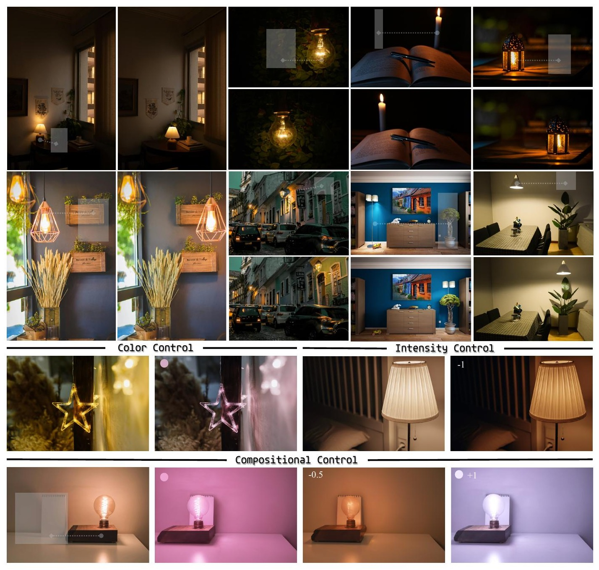
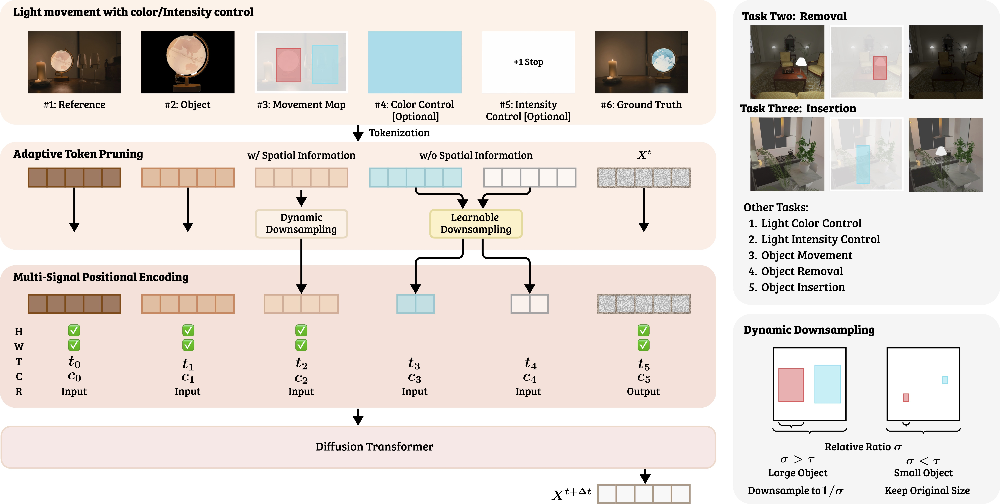

<div align="center">
<h1>LightMover: Generative Light Movement with Color and Intensity Controls</h1>

<a href="https://gengzezhou.github.io/" target="_blank">Gengze Zhou</a><sup>1*</sup>,
<a href="#" target="_blank">Tianyu Wang</a><sup>2†</sup>,<br>
<a href="#" target="_blank">Soo Ye Kim</a><sup>2</sup>,
<a href="#" target="_blank">Zhixin Shu</a><sup>2</sup>,
<a href="#" target="_blank">Xin Yu</a><sup>3</sup>,
<a href="#" target="_blank">Yannick Hold-Geoffroy</a><sup>2</sup>,
<a href="#" target="_blank">Sumit Chaturvedi</a><sup>4</sup>,
<a href="#" target="_blank">Qi Wu</a><sup>1</sup>,
<a href="#" target="_blank">Zhe Lin</a><sup>2</sup>,
<a href="#" target="_blank">Scott Cohen</a><sup>2</sup>

<sup>1</sup>AIML, Adelaide University &nbsp;&nbsp;
<sup>2</sup>Adobe Research &nbsp;&nbsp;
<sup>3</sup>University of Hong Kong &nbsp;&nbsp;
<sup>4</sup>Yale University

<sup>*</sup>Work done during internship at Adobe. &nbsp; <sup>†</sup>Corresponding author.

[](#)&nbsp;
[](https://huggingface.co/datasets/ZGZzz/LightMover-Benchmark)&nbsp;
[](https://gengzezhou.github.io/LightMover/)&nbsp;
[](https://opensource.org/licenses/Apache-2.0)

</div>

<div align="center">

</div>

## Abstract

We present **LightMover**, a framework for controllable light manipulation in single images that leverages video diffusion priors to produce physically plausible illumination changes without re-rendering the scene. We formulate light editing as a sequence-to-sequence prediction problem in visual token space: given an image and light-control tokens, the model adjusts light position, color, and intensity together with resulting reflections, shadows, and falloff from a single view. This unified treatment of spatial (movement) and appearance (color, intensity) controls improves both manipulation and illumination understanding. We further introduce an adaptive token-pruning mechanism that preserves spatially informative tokens while compactly encoding non-spatial attributes, reducing control sequence length by 41% while maintaining editing fidelity. For training our framework, we construct a scalable rendering pipeline that can generate large numbers of image pairs across varied light positions, colors, and intensities while keeping the scene content consistent with the original image. LightMover enables precise, independent control over light position, color, and intensity, and achieves high PSNR and strong semantic consistency (DINO, CLIP) across different tasks.

## Method

LightMover repurposes a pre-trained image-to-video diffusion transformer within a
sequence-to-sequence generation framework.

<div align="center">

</div>

### Unified Framework

The system formulates light editing as visual token sequences. Input includes
reference imagery, object crops, movement maps, and optional color/intensity
parameters processed through video VAE and diffusion transformer architectures to
generate photometrically consistent outputs.

### Adaptive Token Pruning

Spatial controls (movement maps) retain fine-grained tokens in small, localized
regions and are downsampled elsewhere. Non-spatial controls utilize learnable
compression, reducing sequence length by 41%.

### Multi-Signal Positional Encoding (MSPE)

The framework introduces MSPE integrating four orthogonal positional subspaces —
**Spatial**, **Temporal**, **Condition-Type**, and **Frame-Role** encoding —
enabling joint reasoning over spatial alignment and condition relationships.

### Scalable Data Generation

A scalable rendering pipeline using Blender generates 32,000 synthetic data pairs
varying light location, spectrum, and intensity, teaching causal illumination
effects. We also release the **LightMove-A** dataset of real-world image triplets
for evaluation.

## Installation

### Option 1: Using uv

```bash
curl -LsSf https://astral.sh/uv/install.sh | sh

uv venv --python 3.10
source .venv/bin/activate
uv pip install -r requirements.txt
```

### Option 2: Using conda

```bash
conda create -n lightmover python=3.10 -y
conda activate lightmover
pip install -r requirements.txt
```

`dreamsim`, `lpips`, and the OpenAI `clip` package are optional. Install only the
metrics you reference in `configs/metric_config.yaml`:

```bash
pip install dreamsim lpips
pip install git+https://github.com/openai/CLIP.git
```

## Data Preparation

The LightMover code currently ships with the **evaluation toolkit**: it compares
generated images on disk against ground truth from the released benchmarks using
DreamSim / PSNR / LPIPS / DINO / CLIP. No model inference is performed by the
toolkit — you bring the predictions, it computes the metrics.

### LightMover-Benchmark — `ZGZzz/LightMover-Benchmark`

LightMover targets joint **object movement + lighting modification** on real
photographs. Ground-truth pairs are captured from the same scene before/after
the object is physically repositioned, so shadows and global illumination match
the new layout.

| Subset        | # samples | Description                                                          |
| ------------- | --------- | -------------------------------------------------------------------- |
| `Lightmove-A` | 200       | Paired source/target image sets with high-res masks for evaluation.  |

Sample directory layout:

```
data/Lightmove-A/lightmove_001/
    src_input.jpg        # source image (object at original position)
    src_mask_hr.png      # high-res source object mask
    tar_box_mask.png     # target location box mask
    tar_input.jpg        # ground truth (object moved + lighting change)
    object.png           # extracted object
data/Lightmove-A/lightmove_eval.json   # per-sample metadata
```

Download:

```bash
# helper script
HF_TOKEN=hf_xxx python download_data.py \
    --repo-id ZGZzz/LightMover-Benchmark \
    --subset Lightmove-A

# or huggingface-cli
huggingface-cli login
huggingface-cli download ZGZzz/LightMover-Benchmark \
    --repo-type dataset \
    --local-dir ./data \
    --include "Lightmove-A/**"
```

### ObjectMover-Benchmark — `Andyx/ObjectMover-Benchmark`

The toolkit also runs against the ObjectMover benchmark for object movement,
insertion, and removal evaluation:

| Subset      | # samples | Description                                                       |
| ----------- | --------- | ----------------------------------------------------------------- |
| `ObjMove-A` | 200       | Image sets with clean backgrounds and a clean reference.          |
| `ObjMove-B` | 150       | Diverse scenes with complex backgrounds, occlusions, and shadows. |

Download:

```bash
HF_TOKEN=hf_xxx python download_data.py \
    --repo-id Andyx/ObjectMover-Benchmark \
    --subset ObjMove-A
```

> Treat the HF token as a secret — prefer `export HF_TOKEN=...` over passing it on
> the command line.

## Benchmark Results

| Dataset       | mode           | PSNR ↑ | DINO ↑ | CLIP ↑ |
| ------------- | -------------- | ------ | ------ | ------ |
| Lightmove-A   | `crop_average` | 20.385 | 0.8128 | 91.854 |
| ObjMove-A     | `crop_average` | 25.738 | 0.8859 | 91.868 |


## Folder Layout

```
evaluation_toolkit/
├── README.md
├── requirements.txt
├── download_data.py             # downloads HF datasets into ./data
├── configs/
│   ├── eval_config.yaml         # ObjMove-A defaults
│   ├── eval_config_lightmovea.yaml
│   └── metric_config.yaml
├── data/                        # ground truth (downloaded from HF)
├── results/                     # your model outputs go here
│   └── <run_name>/
│       ├── lightmove_001_result.png    # for Lightmove-A
│       ├── real_001_result.png         # for ObjMove-A
│       └── ...
└── src/
    ├── evaluate_results.py
    └── metric_evaluator.py
```

## Evaluation

### 1. Place your generated images

Each prediction must be named `<sample>_result.png` and placed in a single flat
directory:

```
results/my_lightmove_run/
    lightmove_001_result.png
    ...
    lightmove_200_result.png
```

The script auto-detects the prefix (`lightmove_` vs `real_`). Predicted images are
resized to ground-truth resolution as needed.

### 2. Run the evaluation

```bash
# LightMover-Benchmark (Lightmove-A)
python src/evaluate_results.py \
    --config configs/eval_config_lightmovea.yaml \
    --results-dir results/my_lightmove_run

# ObjectMover-Benchmark (ObjMove-A)
python src/evaluate_results.py \
    --config configs/eval_config.yaml \
    --results-dir results/my_objmove_run
```

### Evaluation modes

```bash
python src/evaluate_results.py \
    --config configs/eval_config_lightmovea.yaml \
    --results-dir results/my_lightmove_run \
    --modes all target_crop source_crop
```

| Mode           | Behavior                                                                  |
| -------------- | ------------------------------------------------------------------------- |
| `all`          | Compare full images.                                                      |
| `target_crop`  | Crop to the target box (`tar_box_mask.png`) before metric computation.    |
| `source_crop`  | Crop to the source mask (`src_mask_hr.png`).                              |
| `crop_average` | Run `target_crop` and `source_crop`, then average.                        |

PSNR is always computed on the full uncropped images so the value stays comparable
across modes.

### Output

A JSON file is written next to your results directory:

```json
{
  "crop_average": {
    "evaluation_mode": "crop_average",
    "checkpoint_name": "my_lightmove_run",
    "total_samples": 200,
    "successful_evaluations": 200,
    "average_metrics": {
      "psnr": 20.385,
      "dino": 0.8128,
      "clip": 91.854
    },
    "per_image_metrics": {
      "lightmove_001": {"psnr": 25.50, "dino": 0.900, "clip": 95.35},
      "...": "..."
    }
  }
}
```

A summary is also printed to stdout.

## Configuration Reference

### `configs/eval_config*.yaml`

| Field                   | Meaning                                                       |
| ----------------------- | ------------------------------------------------------------- |
| `gt_dataset_path`       | Path to the GT subset (e.g. `./data/Lightmove-A`).            |
| `metric_config_path`    | Path to the metric YAML.                                      |
| `evaluation_modes`      | List of modes to run.                                         |
| `save_comparison`       | If `true`, write side-by-side GT/Pred PNGs.                   |
| `comparison_output_dir` | Where comparison images go when enabled.                      |

### `configs/metric_config.yaml`

A list of metrics with per-metric options (device, model name, etc.). Comment out
metrics you do not want to compute. PSNR is the only metric that runs without a
GPU model — handy for quick smoke tests.

## Acknowledgement

LightMover builds on the
[ObjectMover](https://huggingface.co/datasets/Andyx/ObjectMover-Benchmark)
benchmark protocol and reuses its evaluation pipeline. We thank the authors for
releasing their data and code.

## Citation

```bibtex
@inproceedings{zhou2026lightmover,
  title={LightMover: Generative Light Movement with Color and Intensity Controls},
  author={Zhou, Gengze and Wang, Tianyu and Kim, Soo Ye and Shu, Zhixin and Yu, Xin and Hold-Geoffroy, Yannick and Chaturvedi, Sumit and Wu, Qi and Lin, Zhe and Cohen, Scott},
  booktitle={Proceedings of the IEEE/CVF Conference on Computer Vision and Pattern Recognition (CVPR)},
  year={2026}
}
```
